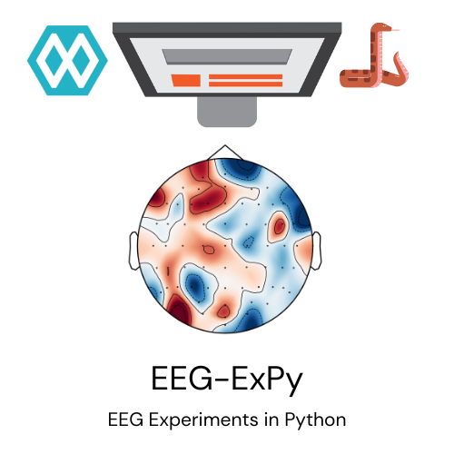
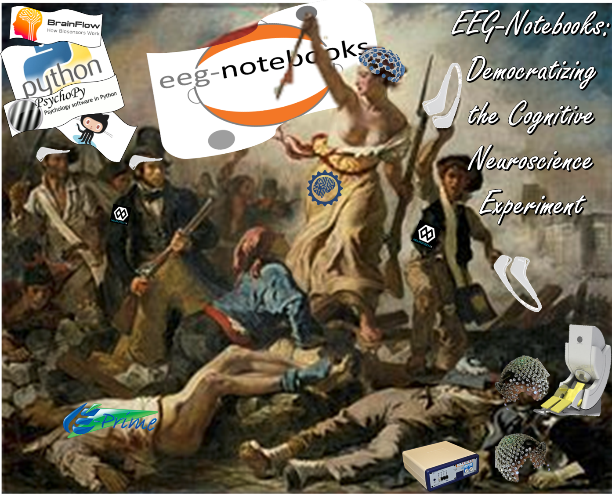

=============
EEG-ExPy
=============

*Democratizing the cognitive neuroscience experiment*

|badge_test| |badge_binder|

.. |badge_test| image:: https://github.com/NeuroTechX/eeg-expy/workflows/Test/badge.svg
   :target: https://github.com/NeuroTechX/eeg-expy/actions

.. |badge_binder| image:: https://mybinder.org/badge_logo.svg
   :target: https://mybinder.org/v2/gh/NeuroTechX/eeg-expy/master

EEG-ExPy is a collection of classic EEG experiments, implemented in Python. The experimental protocols and analyses are quite generic, but are primarily tailored for low-budget / consumer EEG hardware such as the InteraXon MUSE and OpenBCI Cyton. The goal is to make cognitive neuroscience and neurotechnology more accessible, affordable, and scalable.

- **For an intro talk on the ***EEG-ExPy*** (formerly ***eeg-notebooks***) project see:** `JG's Brainhack Ontario presentation <https://www.crowdcast.io/e/brainhack-ontario/7>`_.  
- **For documentation see:** `documentation site <https://neurotechx.github.io/EEG-ExPy/index.html>`_.
- **For code see:** `github site <https://github.com/neurotechx/eeg-expy>`_.
- **For instructions on running experiments see:** `running experiments <https://neurotechx.github.io/EEG-ExPy/getting_started/running_experiments.html>`_.
- **For instructions on initiating an EEG stream see:** `initiating an EEG stream <https://neurotechx.github.io/EEG-ExPy/getting_started/streaming.html>`_.
- **A series of tutorial videos will be coming soon!**  

----

**Note:** eeg-expy was previously known as eeg-notebooks. Before the renaming, eeg-notebooks also underwent major changes to the API in v0.2. The old v0.2 version, before the name change, is still available if you need it, in `this repo <https://github.com/neurotechx/eeg-notebooks_v0.2>`_. The even older v0.1 is also still available if needed `here <https://github.com/neurotechx/eeg-notebooks_v0.1>`_.

----

Overview
--------

EEG-ExPy enables classic EEG cognitive neuroscience experiments using affordable, consumer-grade EEG devices and a standard computer. This makes cognitive neuroscience and neurotechnology accessible for education, research, and clinical applications outside traditional labs.

The project provides:

* Streaming from various wireless consumer-grade EEG devices
* Visual and auditory stimulus presentation, time-locked to EEG recordings
* A growing library of well-documented, ready-to-use experiments
* Signal processing, statistical, and machine learning analysis tools

EEG-ExPy is your one-stop shop for accessible cognitive neuroscience experiments.

Documentation
-------------

The current version is 0.2.X. The codebase and API are under active development and may change.

See the `changelog <https://neurotechx.github.io/EEG-ExPy/changelog.html>`_ for recent updates.

**Full documentation**, including installation, getting started, and troubleshooting, is available at the
`documentation site <https://neurotechx.github.io/EEG-ExPy/index.html>`_.

Acknowledgments
----------------

EEG-ExPy was created by the `NeurotechX <https://neurotechx.com/>`_ hacker/developer/neuroscience community. The initial idea and majority of the groundwork was due to Alexandre Barachant—including the `muse-lsl <https://github.com/alexandrebarachant/muse-lsl/>`_ library, a core dependency. The current lead developer is `John Griffiths <https://www.grifflab.com>`_.

Key contributors: Alexandre Barachant, Hubert Banville, Dano Morrison, Ben Shapiro, John Griffiths, Amanda Easson, Kyle Mathewson, Jadin Tredup, Erik Bjäreholt.

Special thanks to Andrey Parfenov for the excellent `brainflow <https://github.com/brainflow-dev/brainflow/>`_ library, and to the developers of `PsychoPy <https://github.com/psychopy/psychopy/>`_ and `MNE <https://github.com/mne-tools/mne-python/>`_, which are central to EEG-ExPy.

Contribute
----------

We welcome and encourage community contributions!

To suggest features or report bugs, please open an
`issue <https://github.com/NeuroTechX/eeg-expy/issues/new/choose>`_.

Contact
-------

For general discussion, use the `issues page <https://github.com/NeuroTechX/eeg-expy/issues/new/choose>`_.
For questions, email `john.griffiths@utoronto.ca`, or join us on the `NeuroTechX Discord <https://discord.gg/zYCBfBf4W4>`_ or `NeuroTechX Slack <https://neurotechx.herokuapp.com>`_.

   
