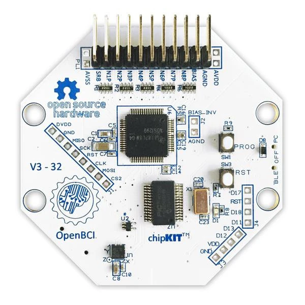
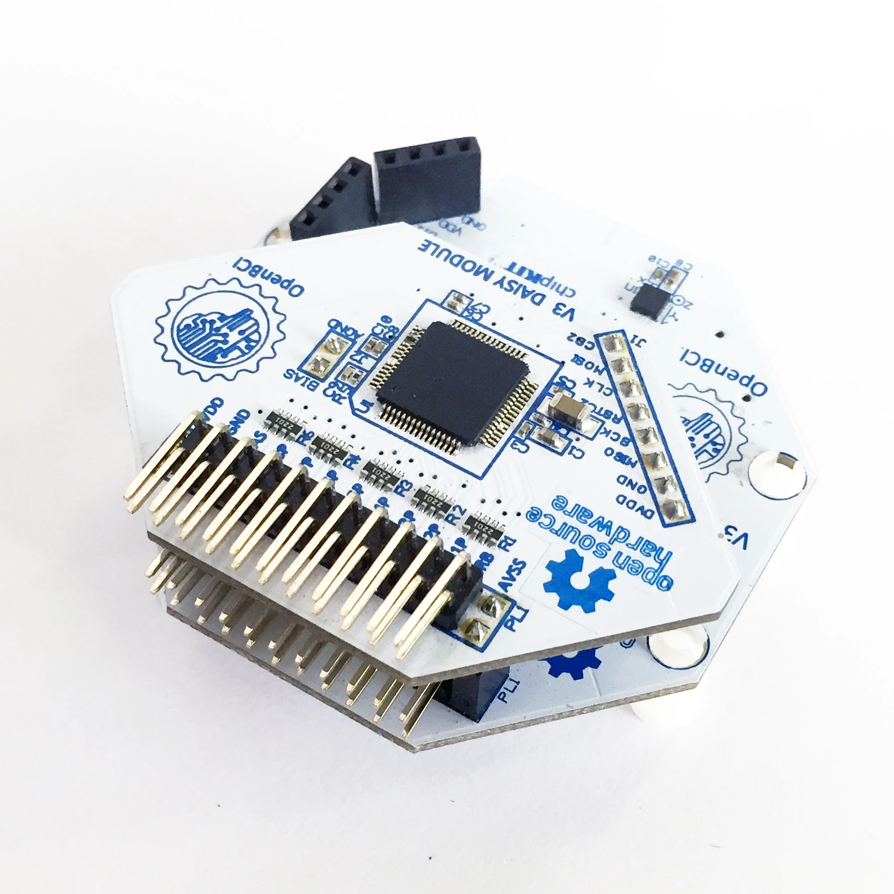

# Initiating an EEG Stream

Before getting going with running an experiment, it is important to first verify that a connection between your computer and EEG device has been successfully established, and the raw EEG data is being streamed and recorded properly.

The exact steps for this vary with the device (MUSE, OpenBCI, others) and operating system (Windows, Mac, Linux) used. When using these instructions, you should make sure you are consulting the section appropriate for your combination of device and OS.

Initiating an EEG stream is a relatively easy process using the `eegnb.devices.eeg.EEG` class which abstracts the
the various devices and backends behind one easy call.

```python
from eegnb.devices.eeg import EEG

# define the name for the board you are using and call the EEG object
eeg = EEG(device='cyton')

# start the stream
eeg.start()
```

These two lines of code abstract a lot of the heavy lifting with respect to switching streaming backends for the various support devices.


## Supported Devices

Below is a list of supported devices and the information needed to connect to each when running the library. Each section also provides common troubleshooting tips for each. If you encounter any errors when connecting which are not listed below please report these on the issues page.

### Interaxon Muse
**Device Names:** *'muse2016'*, *'muse2'*, and *'museS'*
**Backend:** MuseLSL
**Needed Parameters:**  No other parameters are needed, however, if running on Windows 10, then you must also start blue muse before running the experiments.

#### Using the Muse on Windows
To initialize the EEG stream on window you must have Bluemuse running in the background. Open a terminal and start
bluemuse using `start bluemuse;` which should open up a GUI. If you have the USB dongle plugged in and the muse turned on
then you should see a GUI which looks something like the image below.


Once you press the **Start Streaming** button, muse will be streaming data in the background and can the above code can
be run to begin the notebooks interfacing with the bluemuse backend.

### OpenBCI Ganglion


**Device Name:** *'ganglion'* or *'ganglion_wifi'* with WiFi Shield
**Backend:** Brainflow
**Needed Parameters:**
* *mac_addr*: MAC Address (see below for instructions on getting the MAC address)

**Optional Parameters:**
* *serial_port*: Serial port containing the USB dongle. If it does not automatically discover the USB port see the instructions below for finding the serial port in the OpenBCI GUI.


***Finding the Ganglion's MAC address***

(Information needed)

### OpenBCI Cyton


**Device Name:** *'cyton'*  or *'cyton_wifi'* with WiFi Shield
**Backend:** Brainflow
**Needed Parameters:**
**Optional Parameters:**

### OpenBCI Cyton + Daisy

**Device Name:** *'cyton_daisy'*  or *'cyton_daisy_wifi'* with WiFi Shield
**Backend:** Brainflow
**Needed Parameters:**
**Optional Parameters:**

### Neurosity Notion (versions 1 and 2)

**Device Name:** *'notion1'* or *'notion2'*
**Backend:** Brainflow
**Needed Parameters:**  No additional parameters are needed to connect to the Notion. It is necessary however to make sure the Notion is on the same network and readable by Neurosity's developer console.

#### Connecting on Windows
In order to connect to the Notion on Windows you must first turn off your network firewall for the Open Sound Control (OSC) protocol to function for the notion.

### BrainBit EEG Headband

**Device Name:** *'brainbit'*
**Backend:** Brainflow

### G.Tec Unicorn

**Device Name:** *'unicorn'*
**Backend:** Brainflow


## Initiating a Muse stream in Windows using Bluemuse
To initialize the EEG stream on window you must have Bluemuse running in the background. Open a terminal and start
bluemuse using `start bluemuse;` which should open up a GUI. If you have the USB dongle plugged in and the muse turned on
then you should see a GUI which looks something like the image below.


Once you press the **Start Streaming** button, muse will be streaming data in the background and can the above code can
be run to begin the notebooks interfacing with the bluemuse backend.


## Finding the USB port of the OpenBCI USB dongle
If the library is not connecting to an OpenBCI device this might be an issue of defaulting to the wrong serial
port. If this is happening you can check the serial port of the dongle by opening the OpenBCI GUI and navigating to the
menu pictures below.


Now that we have the COM port, we can initiate the stream by passing it to the EEG device in the object call.
```python
from eegnb.devices.eeg import EEG

# define the name for the board you are using and call the EEG object
eeg = EEG(
    device='cyton',
    serial_port='COM7'
)

# start the stream
eeg.start()
```

This issue is more common on windows installations, and the image above is shown on a windows OS. However it might still
be possible for it to happen in Linux and in any case, the process for determining the USB port of the dongle is the same.

