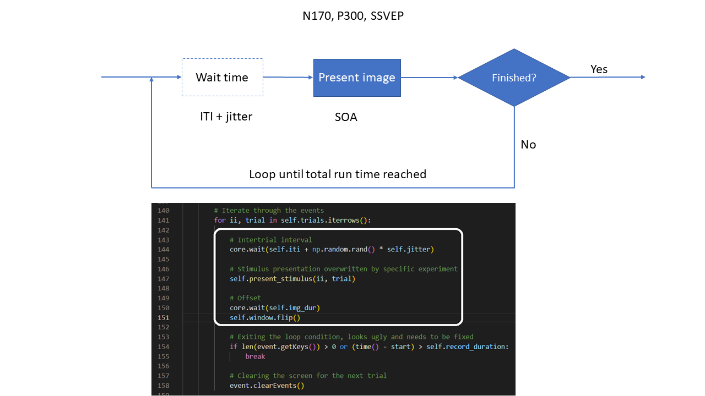
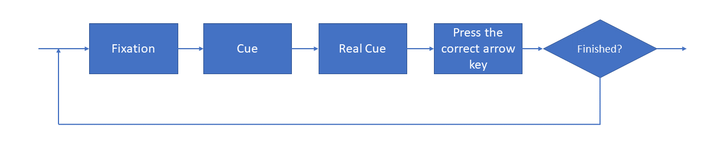
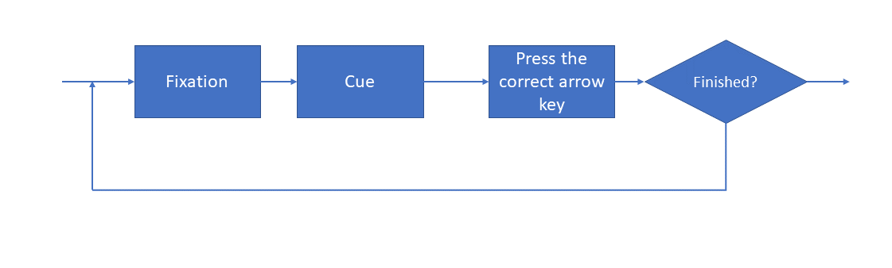

# Summer School

## N170 P300 SSVEP
These three share the same parent class.





## Visual Cue, Codeprose
These two are implemented as individual functions not in the form of class.







## Data Processing
By default data will be saved at a local path, similar to
```
~/.eegnb/data/<experiment name>/<site>/<device_name>/<subject_id>/<session_id>/*.csv
```
An example 
```
~/.eegnb/data/Summer_School_N170/local/muse2_bfn/subject0001/session001/recording_2023-05-07-22.54.38.csv
```

In the analysis file **summer_school_n170_decoding.py** (lines 59~61), we need to update the code as
```
raw = load_data(subject,session,
                experiment='Summer_School_N170', site='local', device_name='muse2_bfn',
                data_dir = eegnb_data_path)
```
